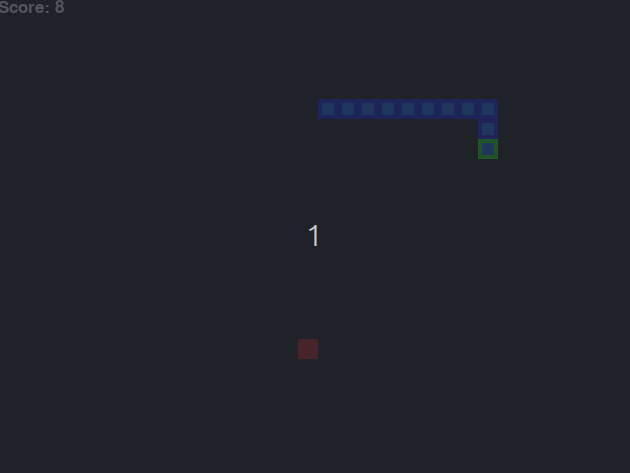
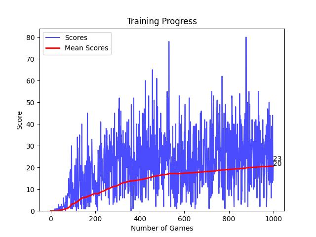

# Snake AI com Q-Learning

Este projeto implementa um agente de Inteligência Artificial que aprende a jogar Snake usando **Q-Learning**, um algoritmo de aprendizado por reforço. O agente aprende através da experiência, melhorando sua performance ao longo dos episódios de treinamento.

## 📋 Descrição

O projeto consiste em:

- **Jogo Snake**: Implementado com pygame, onde a cobra deve comer frutas sem bater nas paredes ou em si mesma
- **Agente Q-Learning**: IA que aprende a jogar através de tentativa e erro
- **Visualização**: Interface gráfica para acompanhar o treinamento e gráficos de progresso
- **Otimização**: Interface aparece apenas a cada 50 jogos para acelerar o treinamento

## 🎮 Como Funciona

### Estados

O agente observa 11 características do ambiente:

- **Perigos** (3): Reto, direita, esquerda
- **Direção atual** (4): Esquerda, direita, cima, baixo
- **Localização da comida** (4): Esquerda, direita, cima, baixo da cabeça

### Ações

- **[1,0,0]**: Continuar reto
- **[0,1,0]**: Virar à direita
- **[0,0,1]**: Virar à esquerda

### Recompensas

- **+10**: Comer uma fruta
- **-10**: Colidir (game over)
- **0**: Movimento normal

## 🚀 Como Executar

### Pré-requisitos

```bash
pip install -r requirements.txt
```

### Executar o Treinamento

```bash
python3 train.py
```

### Estrutura do Projeto

```
q-learning/
├── agent.py           # Implementação do agente Q-Learning
├── snake.py           # Jogo Snake com pygame
├── train.py           # Script principal de treinamento
├── requirements.txt   # Dependências do projeto
└── README.md         # Este arquivo
```

## 🧠 Algoritmo Q-Learning

### Parâmetros

- **Alpha (α = 0.1)**: Taxa de aprendizado
- **Gamma (γ = 0.9)**: Fator de desconto
- **Epsilon (ε)**: Taxa de exploração (inicia em 0.8, decai gradualmente)

### Fórmula de Atualização

```
Q(s,a) = Q(s,a) + α * [r + γ * max(Q(s',a')) - Q(s,a)]
```

Onde:

- `s`: Estado atual
- `a`: Ação tomada
- `r`: Recompensa recebida
- `s'`: Próximo estado
- `α`: Taxa de aprendizado
- `γ`: Fator de desconto

## 📊 Visualizações

### Interface do Jogo

- **Cobra**: Azul com cabeça verde
- **Comida**: Vermelho
- **Score**: Pontuação atual
- **Game**: Número do episódio atual

### Gráfico de Progresso

- **Linha azul**: Score de cada jogo
- **Linha vermelha**: Média móvel dos scores
- Atualizado a cada 5 jogos

### Estatísticas no Terminal

```
Game  150 | Score:  3 | Record:  8 | Mean: 2.1 | Epsilon: 0.020 | Q-States: 245
```

## 🖼️ Exemplos de Resultados

### GIF da IA jogando após 1000 episódios

<p align="center">
    
</p>

### Gráfico de performance do algoritmo após 1000 episódios

<p align="center">
    
</p>

## ⚙️ Configurações

### Modificar Frequência da Interface

Em `train.py`:

```python
show_ui = (agent.n_games % 50 == 0 and agent.n_games > 0) or agent.n_games == 0
```

Altere `50` para o intervalo desejado.

### Ajustar Velocidade do Jogo

Em `snake.py`:

```python
SPEED = 40  # FPS quando a interface está ativa
```

### Modificar Hiperparâmetros

Em `train.py`:

```python
agent = Agent(q_table={}, alpha=0.1, gamma=0.9, epsilon=0.8)
```

### Métricas de Performance

- **Q-States**: Número de estados únicos na tabela Q
- **Epsilon**: Diminui gradualmente (exploração → exploração)
- **Mean Score**: Média dos últimos jogos

## 🔧 Personalização

### Modificar Recompensas

Em `snake.py`, método `play_step()`:

```python
if reward_eaten:
    reward = 10    # Recompensa por comer
else:
    reward = 0     # Sem penalidade por movimento

if self.is_collision():
    reward = -10   # Penalidade por colidir
```

### Alterar Estado do Agente

Em `snake.py`, método `get_state()`:

```python
state = [
    # Adicione novas características aqui
    # Exemplo: distância até a comida, tamanho da cobra, etc.
]
```

## 📄 Licença

Este projeto é desenvolvido para fins educacionais como parte do curso de Inteligência Artificial da FCT UNESP.
